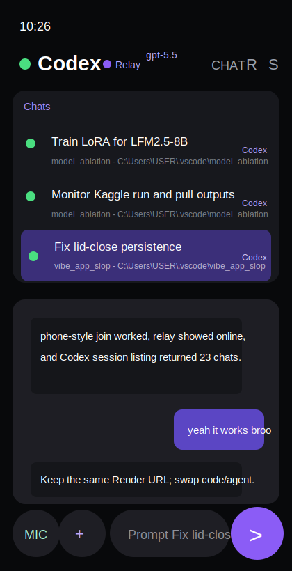

# codex-OC_mobile

Remote control Codex and OpenCode from your phone through a desktop relay.



```text
Phone --wss--> Relay Server <--wss-- Laptop relay
                                      |-- Codex local session
                                      `-- OpenCode local server
```

## Features

- Relay-only execution: the cloud server never calls model APIs and does not need API keys.
- QR or manual pairing: keep the same Render URL and swap only the session code/agent.
- Codex support: lists Codex app chats including loaded/current chats, opens a selected chat in Codex Desktop with `codex://local/<threadId>`, resumes/steers turns through the local Codex app-server, and blocks accidental new Codex sessions from the phone.
- OpenCode support: starts or reuses the local OpenCode HTTP server, lists recent OpenCode sessions, and prompts a selected session.
- Live phone transcript: shows user prompts, assistant responses, thinking/status events, shell/tool activity, and file-change summaries without dumping stale terminal noise.
- Technical event toggle: command output plus latest-turn tool/file counts stay hidden unless explicitly enabled in Settings.
- Running-turn composer: while a turn is active, the send button shows progress; typing a draft changes it back to send so the prompt is steered into the active turn.
- Chat controls: refresh chat lists, collapse/show the chat list, copy the visible transcript, and jump back to the latest message when scrolled up.
- In-app update entry: Settings includes an update-page button for grabbing the latest APK.
- Desktop relay persistence: the relay keeps the same code across reconnects unless `backend/relay-state.json` is deleted or `AGENTHUB_RELAY_CODE` is changed.
- Background-friendly Android client: keeps the screen awake while open, preserves the selected chat/transcript, reconnects after socket drops, and refreshes state on resume.
- Voice input: Android/Google speech-to-text can fill the prompt box directly.
- File upload: phone attachments are copied to `.agenthub_uploads/` on the laptop and appended to the agent prompt.
- Multi-phone safe: every phone joined to the same session receives relay status and stream updates.
- Offline behavior: if the laptop relay is offline, the phone receives an offline error instead of falling back to cloud execution.

## Quick Start

### 1. Deploy the server

```bash
git clone https://github.com/HOLYKEYZ/vibe-app-slop.git
cd vibe-app-slop/backend
npm install
node server.js
```

Deploy `backend/` on Render as a Node.js web service. Port `3001`.

### 2. Install Android app

```bash
cd AgentHub
./gradlew assembleDebug
```

The APK is written to `AgentHub/app/build/outputs/apk/debug/app-debug.apk`.

### 3. Start the laptop relay

```bash
cd backend
npm install
SERVER_URL=wss://your-server.onrender.com node relay.js
```

The relay checks for signed-in local Codex/OpenCode installs and prints a QR code. Secrets stay on the laptop.

On Windows PowerShell:

```powershell
cd C:\Users\USER\.vscode\vibe_app_slop\backend
$env:SERVER_URL="wss://agent-hub-backend-wk48.onrender.com"
node relay.js
```

For the current Windows laptop workflow, use the keep-awake launcher from the repo root:

```powershell
.\scripts\start-relay-keepawake.ps1 -RelayCode EtCjwygP8e
```

That script sets the current Windows power plan to keep the machine awake and to do nothing on lid close for AC and battery power, then starts the relay in the background with logs in `%TEMP%`. Use `-Foreground` if you want the relay output in the current terminal, or `-SkipPowerConfig` if you only want to start the relay.

To force a new code:

```powershell
Remove-Item .\relay-state.json -Force -ErrorAction SilentlyContinue
$env:SERVER_URL="wss://agent-hub-backend-wk48.onrender.com"
node relay.js
```

### 4. Connect your phone

Open Agent Hub, scan the QR code, pick a visible chat, and send a prompt.

## Agents

| Agent | How it is driven |
|-------|------------------|
| Codex | Local `codex app-server` API first; CLI JSON resume only if explicitly enabled with `AGENTHUB_CODEX_CLI_FALLBACK=1` |
| OpenCode | Local `opencode serve` HTTP API on `127.0.0.1:4096` |

## Environment

| Env | Default | Description |
|-----|---------|-------------|
| `PORT` | `3001` | Relay server port |
| `SERVER_URL` | `ws://localhost:3001` | Relay server URL used by `relay.js` |
| `AGENTHUB_CWD` | repo root | Working directory for local agents |
| `OPENCODE_PORT` | `4096` | Local OpenCode server port |
| `CODEX_APP_SERVER_URL` | `ws://127.0.0.1:4545` | Local Codex app-server URL |
| `AGENTHUB_RELAY_CODE` | unset | Optional fixed relay code |
| `AGENTHUB_CODEX_CLI_FALLBACK` | unset | Set to `1` to allow Codex CLI resume fallback |

## Notes

- The phone app can keep `wss://agent-hub-backend-wk48.onrender.com` as the server URL. The session code and selected agent are separate settings.
- The cloud server is only a WebSocket switchboard between phone and laptop relay. Codex/OpenCode credentials and files stay on the laptop.
- The relay can survive the lid closing only if Windows stays awake. Use `scripts/start-relay-keepawake.ps1` or set your power plan manually.
- Uploads are stored under `.agenthub_uploads/` in the relay working directory.
- If the exact screenshot asset is needed, save it under `docs/screenshots/` and replace the README image path.
